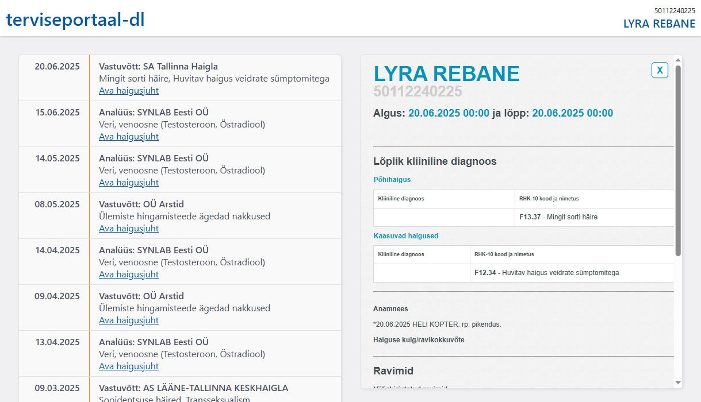

# terviseportaal-dl

This is an unofficial script for downloading your data off of terviseportaal.ee.

Antud skriptiga saate terviseportaal.ee-st oma andmed alla laadida.

## Usage / Kasutamine

1. Make sure python3 is installed and has the `requests` package.
2. Run the script (e.g. `python terviseportaal-dl.py`).
3. Log into terviseportaal.ee and get your `__Host-SESSION` cookie, paste it into the script.
	- In Chrome you can find the cookie in DevTools (F12) -> Application -> Cookies -> `https://minu.terviseportaal.ee`. Copy the value only.
4. The script will download your data and say when it's done.
5. Once the download is complete, open the folder that was created, and from there open the `_index.html` file.

1. Installi python3 koos `requests` pakiga.
2. Käivita skript (nt `python terviseportaal-dl.py`).
3. Logi sisse terviseportaal.ee lehel ja leia oma `__Host-SESSION` küpsis, sisesta see skripti.
	- Chrome'is leiab küpsised DevTools (F12) -> Application -> Cookies -> `https://minu.terviseportaal.ee` alt. Kopeeri ainult väärtus (Value).
4. Skript laeb andmed alla ning annab teada, kui kõik on valmis.
5. Kui kõik on valmis, ava tekkinud kaustas olev `_index.html` fail.

# Why download your data?

Computers are never perfect, and there's a very real possibility of data loss due to data corruption, cyber attacks (ransomware), and law changes (e.g. privacy and data-retention). Besides, a local copy of your data is way faster to browse and works even if there's an outage.

And also it's your data, you're allowed to have it.
